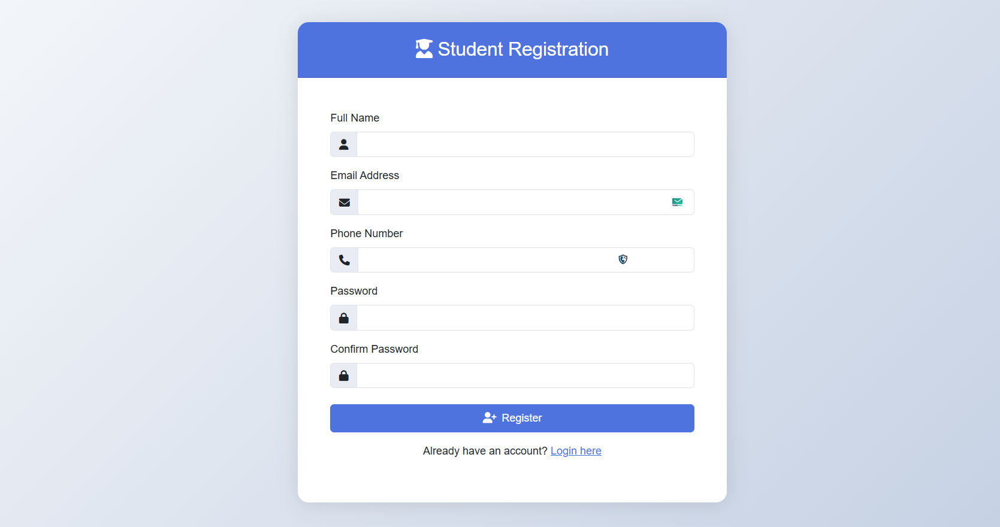
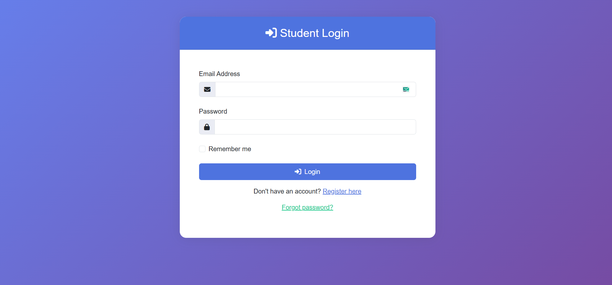
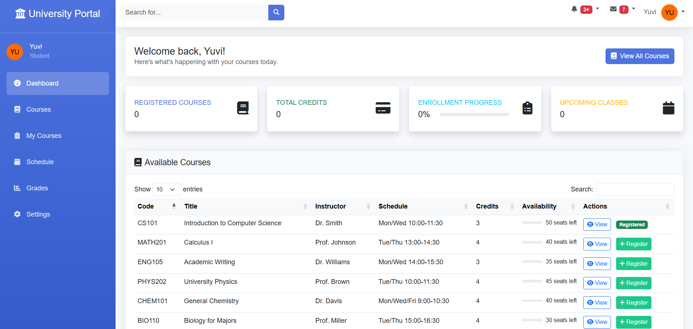

# 🚀 Simple Register & Login Page with Backend Integration


## 📌 Description

This is a **fully functional user authentication system** built using **Node.js**, **Express**, and **Bootstrap**. It includes a secure registration and login page with proper validations, database connectivity, and a dynamic home page that welcomes the logged-in user.

---

## ✨ Features

- 🔐 Secure user registration with:
  - Username
  - Email
  - Phone Number
  - Password + Confirm Password

- 🔑 User login using Email and Password

- ✅ Form validations for all fields

- 🎨 Beautiful and responsive UI using **Bootstrap 5**

- 🧠 Displays **Welcome message** with the username after login

- 📦 Backend with **Express.js** and **MongoDB**

- 🗂️ Clean folder structure with separation of concerns

---

## 🖥️ Screenshots

| Register Page |
|---------------|
|  |

 Login Page | 
|------------|
|  |

| Home Page |
| -----------|
|  |

---

## 🛠️ Tech Stack

- **Frontend**: HTML, CSS, Bootstrap, JavaScript
- **Backend**: Node.js, Express.js
- **Database**: MongoDB
- **Templating**: EJS / HTML
- **Version Control**: Git & GitHub

---

## 📂 Folder Structure


---

## 🚀 Getting Started

### 1. Clone the repository
```bash
git clone https://github.com/YuviRathod/Simple-Register-Login-Page.git
cd Simple-Register-Login-Page

1. npm install
2. node server.js
```
### 1. live demo url
 https://simple-register-login-page.onrender.com/login
